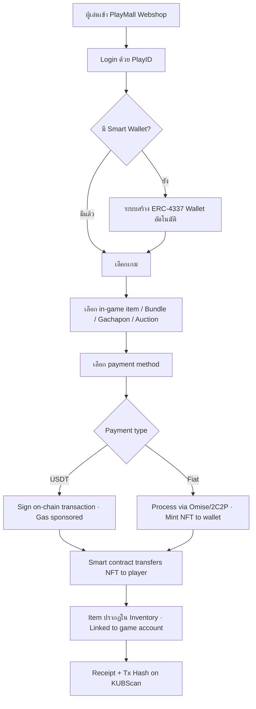
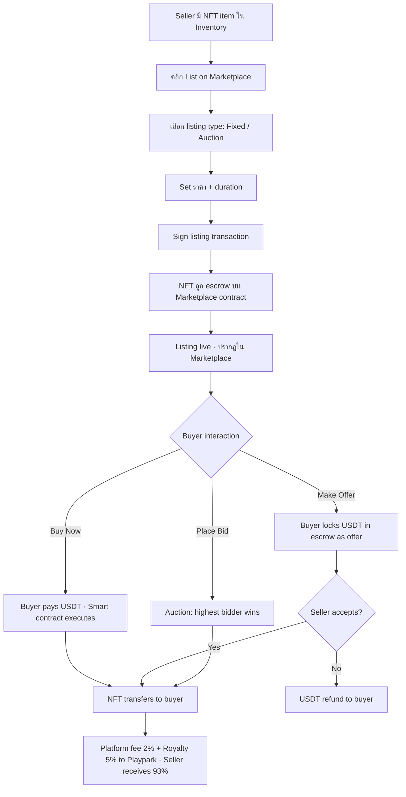

# Business Requirements Document
## Webshop & Marketplace Platform for Playpark
### Concept 1 — Full Integrated Platform

| Field | Value |
|---|---|
| **Document ID** | BBT-BRD-PWGF-001 |
| **Project Code** | PWGF (Playpark Webshop GameFi) |
| **Document Version** | 0.1 (Draft) |
| **Date** | 20 May 2026 |
| **Classification** | CONFIDENTIAL — DO NOT DISTRIBUTE |
| **Prepared by** | Bitkub Blockchain Technology |
| **Client** | Asphere Innovations / Playpark |
| **Status** | 🟡 Draft for Stakeholder Review |

---

## Document Approval

| Role | Name | Signature | Date |
|---|---|---|---|
| Prepared by (Product Manager · BBT) | | | |
| Reviewed by (Tech Lead · BBT) | | | |
| Reviewed by (BD Lead · BBT) | | | |
| Approved by (CEO · BBT) | | | |
| Approved by (Playpark Representative) | | | |

---

## Revision History

| Date | Revision | Editor | Note |
|---|---|---|---|
| 20 May 2026 | 0.1 | BBT Product Team | Initial draft for review |

---

## Table of Contents
1. Executive Summary
2. Background
3. Project Objectives
4. Project Scope
5. Key Stakeholders
6. Project Constraints
7. Business Requirements
8. Business Process
9. Change Impact

---

# Project Overview

## 1. Executive Summary

โครงการนี้คือการพัฒนา **Webshop และ Marketplace แบบครบวงจร** สำหรับ Playpark — รองรับทุกเกมในเครือ ทำหน้าที่เป็นทั้ง **Primary Market** (publisher ขาย in-game items ให้ผู้เล่น) และ **Secondary Market** (ผู้เล่นซื้อ-ขาย NFT-based items ระหว่างกัน) บน **Bitkub Chain (KUB)**

จุดเด่นของแนวทางนี้คือการเปลี่ยน Playpark จากผู้จัดจำหน่ายเกมแบบดั้งเดิม ให้กลายเป็น **first AAA Web3 publisher ใน SEA** ที่มี platform infrastructure ของตัวเอง — สามารถ capture revenue จากตลาดมือสอง (royalty), เปิด format ขายใหม่ (Bundle / Gachapon / Auction), และสร้าง interoperability ระหว่างเกมในเครือ

แนวทางนี้ใช้เวลาพัฒนาแบบ aggressive **4–6 เดือน** (เน้น MVP-first, parallel workstream, leveraging Bitkub Group infrastructure) และต้องการ regulatory clearance (ใบอนุญาตที่เกี่ยวข้องจากสำนักงาน ก.ล.ต. และ ธปท.) แต่ให้ผลตอบแทนเชิงกลยุทธ์สูง — ทั้งในแง่ revenue uplift (+30-40% ARPU จาก secondary market royalty) และ brand positioning ระยะยาว

## 2. Background

Playpark เป็นผู้จัดจำหน่ายเกมออนไลน์ในประเทศไทยมากว่า 20 ปี โดยมี portfolio เกมหลากหลาย เช่น MapleStory, Yulgang, Audition, FLYFF Universe, Rakion ปัจจุบัน Playpark ดำเนินการ webshop ของตัวเองในนาม **PlayMall** ซึ่งรองรับการเติม TH Point ผ่านช่องทางการชำระเงินภายในประเทศ (Credit Card, QR PromptPay, K Plus, SCB Easy, ฯลฯ)

อย่างไรก็ตาม Playpark ยังเผชิญข้อจำกัด 3 ประการ:

1. **Item trading underground (RMT)** — ผู้เล่นมีการซื้อ-ขายไอเทมในเกมระหว่างกันผ่านช่องทางที่ Playpark ไม่ควบคุม ทำให้สูญเสีย revenue opportunity และเสี่ยงต่อปัญหา dispute/scam
2. **ขาด true ownership** — ผู้เล่นไม่สามารถ "เป็นเจ้าของจริง" ของไอเทมในเกม ทำให้ engagement ระยะยาวต่ำกว่าที่ควรจะเป็น
3. **Cross-game economy ไม่มี** — แต่ละเกมในเครือ Playpark มีระบบเศรษฐกิจแยกกัน ไม่มี interoperability

ในขณะเดียวกัน Bitkub Chain (KUB) มี ecosystem ที่พร้อมรองรับ Web3 use cases โดยมี **Bitkub NEXT** (KUB Wallet) ที่มีผู้ใช้กว่า 1 ล้านคน และ Asphere Innovations (parent ของ Playpark) ได้ก่อตั้ง **Kubplay Entertainment** ร่วมกับ Bitkub Capital เพื่อพัฒนาเกมบน KUB Chain แล้ว (ตัวอย่างเช่น TSX by Astronize — Open Beta เม.ย. 2024)

**Competitive Landscape:** Competitor ที่ใกล้เคียงที่สุดในตลาด Thai Web3 gaming คือ **NEXT Market** ([nextmarket.games](https://www.nextmarket.games/)) ซึ่งเป็น multi-game webshop + marketplace platform ที่ใช้ **Unifi Wallet** เป็น wallet infrastructure จุดยืน competitive ของ Concept 1 จึงต้องเน้น differentiator ที่ NEXT Market ไม่มี ได้แก่:
- **Bitkub Group end-to-end stack** (KUB Chain + KUB Wallet + Bitkub Exchange + fiat on/off-ramp) — vertical integration ที่ NEXT Market/Unifi Wallet ไม่มี
- **Co-marketing reach** ผ่าน Bitkub Exchange 5M+ user base
- **Compliance-first** — leverage Bitkub Group licensed infrastructure แทนการขอ license ใหม่

โครงการนี้จึงเป็นการต่อยอด partnership ที่มีอยู่ในระดับ portfolio-wide

## 3. Project Objectives

1. **เพิ่ม Average Revenue Per User (ARPU)** ขั้นต่ำ **30%** ภายใน 12 เดือนหลัง launch ผ่านการเปิด secondary market royalty (5% per transaction) และ sale format ใหม่ๆ
2. **Capture RMT volume อย่างน้อย 20%** ของ underground trading ของเกมในเครือ ภายใน 12 เดือน
3. **สร้าง Web3-native user base** อย่างน้อย **100,000 wallet addresses** ที่ active ภายใน 12 เดือนหลัง launch
4. **เปิด secondary marketplace ครบทุก flagship เกม** (MapleStory + Yulgang + Audition) ภายใน 6 เดือน
5. **บรรลุ compliance ครบทุกประเด็น** ที่เกี่ยวข้องกับ ก.ล.ต., ธปท., และ AMLO ก่อน public launch
6. **Brand positioning**: Playpark = first AAA Web3 publisher ใน SEA ภายในปี 2026-2027

## 4. Project Scope

### In Scope

- **Webshop (Primary Market)** สำหรับขาย in-game items ของ publisher
  - รูปแบบขาย 4 ประเภท: Single item, Bundle Pack, Gachapon, Auction
- **Marketplace (Secondary Market)** สำหรับ P2P trading ระหว่างผู้เล่น
  - Fixed-price listing + Auction listing
  - Offer / Counter-offer system
  - On-chain escrow + royalty enforcement (EIP-2981)
- **PlayID + Smart Wallet** (ERC-4337 Account Abstraction)
  - Single sign-on ใช้ได้ทุกเกมในเครือ
  - Social login + passkey
  - Gas-less transactions (paymaster-sponsored)
- **Payment methods**:
  - USDT (Tether) บน KUB Chain — primary
  - Credit Card (via Omise/2C2P)
  - QR PromptPay
  - Bank Transfer
- **Per-game branding** สำหรับแต่ละเกม
- **Multi-language**: Thai (default) + English
- **Mobile-responsive** web platform
- **Admin dashboard** สำหรับ Playpark จัดการ catalog, transactions, analytics
- **KYC integration** (NDID) สำหรับ transactions เกินเกณฑ์ AMLO
- **Compliance**: ก.ล.ต. / ธปท. / AMLO ทุกประเด็น

### Out of Scope

- การพัฒนาเกมเอง (Playpark ใช้ catalog เกมที่มีอยู่)
- Cross-chain bridge ไปยัง chain อื่น (KUB Chain only ใน v1)
- Mobile native apps (web responsive only ใน v1)
- Real-time multiplayer trading (asynchronous only)
- Custodial wallet service (non-custodial AA only เพื่อหลบ licensing requirement)
- การโฆษณา/marketing ภายในเกมของ publisher อื่น (เฉพาะเกม Playpark)
- Token issuance / ICO (ใช้ USDT เป็น settlement currency เท่านั้น)
- Customer support outsourcing (Playpark จัดการ first-line, BBT จัดการ blockchain layer)

## 5. Key Stakeholders

| Name | Job Role | Duties |
|---|---|---|
| TBD | CEO · Playpark | Final decision, strategic direction, brand approval |
| TBD | CFO · Playpark | Budget approval, revenue model sign-off |
| TBD | CPO · Playpark | Product specification, game integration, item catalog |
| TBD | Head of Marketing · Playpark | Player communication, KOL coordination, launch campaign |
| TBD | Legal Counsel · Playpark | Compliance review, contract terms, dispute resolution policy |
| TBD | CEO · Bitkub Blockchain Technology | Infrastructure commitment, partnership terms |
| TBD | Tech Lead · BBT | Architecture design, smart contract development, security |
| TBD | Product Manager · BBT | Requirement coordination, sprint planning, delivery |
| TBD | Compliance Lead · BBT | Regulatory engagement (ก.ล.ต., ธปท., AMLO), KYC vendor management |
| End Users | Thai/SEA Gamers | Buy items, trade, hold NFT-based assets |
| Game Publishers | Nexon, AC Game Group, etc. | License catalog terms, royalty share |

## 6. Project Constraints

| Constraint | Description |
|---|---|
| **Regulatory** | ต้องผ่าน clearance จาก ก.ล.ต. (Digital Asset Royal Decree 2561) ก่อน mainnet launch · USDT acceptance ต้องผ่านการตีความตาม ทธ. 5/2565 (means-of-payment ban) · KYC ต้องครบตามเกณฑ์ AMLO |
| **Timeline** | Development + regulatory clearance ใช้เวลา **4–6 เดือน** ก่อน open public launch (aggressive MVP-first, parallel workstream) |
| **Budget** | TBD — รายละเอียดงบประมาณจะกำหนดหลัง scope confirmation กับ Playpark · ครอบคลุม infrastructure, smart contract audit, legal counsel, KYC vendor, marketing |
| **Technical** | Smart contracts ต้องผ่าน audit (Hacken/Certik/Beosin) ก่อน mainnet · KUB Chain testnet (chainId 25925) → mainnet · ห้ามใช้ ethers.js (ใช้ viem/wagmi) |
| **Brand** | Per-game branding ต้องได้รับ approval จาก publisher แต่ละราย (เช่น Nexon สำหรับ MapleStory) |
| **Risk Acceptance** | Public launch ต้องมี Risk Acceptance Signature จาก CEO ของทั้ง 2 ฝั่ง + Chief Legal |

## 7. Business Requirements

| ID | Requirement Description |
|---|---|
| BR-001 | Platform must support multi-game asset management for all Playpark portfolio games (MapleStory, Yulgang, Audition, FLYFF Universe, etc.). |
| BR-002 | Platform must provide a Webshop (Primary Market) where game publishers can sell official in-game items directly to players. |
| BR-003 | Platform must provide a Marketplace (Secondary Market) where players can trade NFT-based in-game items peer-to-peer. |
| BR-004 | The Webshop must support 4 sale formats: (a) Single item, (b) Bundle Pack with discount, (c) Gachapon with drop rates, (d) Auction with bidding. |
| BR-005 | The Marketplace must support fixed-price listings, auction listings with countdown, and offer/counter-offer mechanics. |
| BR-006 | System must accept USDT (Tether) on KUB Chain (KAP-20) as a primary payment method, with optional 3% discount as incentive. |
| BR-007 | System must accept fiat payment methods (Credit Card via Omise, QR PromptPay, Bank Transfer) for users without crypto wallets. |
| BR-008 | System must implement Non-custodial Smart Wallet (ERC-4337 Account Abstraction) integrated with PlayID for single sign-on across all games. |
| BR-009 | Platform must sponsor gas fees (paymaster pattern) so end users experience gas-less transactions. |
| BR-010 | System must enforce creator royalty (EIP-2981 standard) on every secondary market transaction. Default royalty rate: **5%**, configurable per game. |
| BR-011 | Platform must comply with Thai SEC (Digital Asset Royal Decree 2561), BOT (means-of-payment guideline), and AMLO (KYC/transaction reporting) requirements. |
| BR-012 | System must integrate KYC verification (NDID or equivalent) for transactions exceeding the AMLO threshold (≥ 100,000 THB per transaction). |
| BR-013 | Platform must provide an Admin Dashboard for Playpark to manage games, item catalogs, sale formats, royalty rates, fees, and view analytics. |
| BR-014 | System must support both Thai (primary) and English languages across all user-facing screens. |
| BR-015 | Platform must support per-game branding customization (hero banner, accent color, item style) while maintaining unified KUB infrastructure underneath. |
| BR-016 | System must generate platform fees on every transaction (Primary: 2-5% to BBT; Secondary: 2% platform + 5% royalty to Playpark). |
| BR-017 | Platform must provide transaction history and on-chain verification (link to KUBScan) for every purchase. |
| BR-018 | System must integrate with existing Playpark PlayID to migrate user identity seamlessly (PlayID ↔ smart wallet mapping). |
| BR-019 | Platform must launch on KUB Chain testnet first (chainId 25925) for pilot, then migrate to mainnet after regulatory clearance and audit. |
| BR-020 | System should support cross-game item interoperability in Phase 2 (e.g., items earned in MapleStory can be used in Yulgang where applicable). |
| BR-021 | Platform must provide refund mechanism for failed/disputed transactions within 24 hours. |
| BR-022 | System must log all transactions in tamper-proof on-chain records for compliance audit. |
| BR-023 | Platform must operate 99.5% uptime (excluding scheduled maintenance windows). |
| BR-024 | System should support advanced features in future phases: lending/staking of items, fractional ownership, cross-chain bridging (Phase 3+). |
| BR-025 | Platform must support phased rollout: Phase 0 (prototype) → Phase 1 (sandbox/closed beta with 1 game) → Phase 2 (multi-game expansion) → Phase 3 (full public launch). |

## 8. Business Process

### Primary Market Flow (Webshop)

### Secondary Market Flow (Marketplace)

## 9. Change Impact

### People / Roles

| Role | Current State | Future State | Impact Level | Mitigation |
|---|---|---|---|---|
| Playpark CS Team | จัดการ dispute RMT แบบ manual | จัดการ on-chain dispute (escrow-based) | Medium | Training + automated tools |
| Playpark Game Ops | จัดการ catalog แต่ละเกมแยกกัน | Unified admin dashboard | Medium | Onboarding + new SOP |
| Playpark Marketing | F2P + IAP campaigns | + Web3 storytelling, KOL crypto-aware | High | New marketing capability hire / training |
| Playpark Finance | Cash flow จาก fiat top-up only | + USDT settlement (crypto bookkeeping) | High | Hire crypto accountant / outsource |
| Game Publishers (Nexon, etc.) | ขายผ่าน Playpark, ได้ revenue share | + Royalty income จาก secondary market | Positive | Contract amendment |
| BBT Engineering | สนับสนุน Bitkub NEXT + other dApps | + Dedicated team สำหรับ Webshop GameFi | Medium | Resource allocation |

### Processes / Workflows

| Process | Current State | Future State | Impact Level | Mitigation |
|---|---|---|---|---|
| Item Purchase | Top-up TH Point → spend in game | Direct purchase on Webshop (NFT issued to wallet) | High | Phased migration · Keep TH Point for backward compatibility |
| Item Trading | Banned/discouraged (or via grey market) | Sanctioned via Marketplace with escrow | High | Player education campaign · Migration incentive |
| Revenue Recognition | Game-by-game, fiat-based | Cross-game, multi-currency (USDT + fiat) | High | New accounting workflow + audit trail |
| Dispute Resolution | Manual CS ticket | Automated escrow + on-chain proof | Medium | New SOP for cases requiring CS intervention |
| Game Economy Monitoring | Per-game analytics | Cross-game economic dashboard | Medium | New BI tooling |
| Regulatory Reporting | F2P licensing only | + AMLO transaction reports · ก.ล.ต. compliance | High | Compliance officer · automated reports |
| Customer Onboarding | PlayID registration | + Smart wallet creation (automated) | Low | UX hides wallet complexity |

---

## Recommended Phasing

| Phase | Duration | Scope | Gate |
|---|---|---|---|
| **Phase 0 — Prototype & Alignment** | 2–3 weeks | Mockup, PRD, BRD, legal opinion engagement (parallel) | Stakeholder approval |
| **Phase 1 — Compliance Setup (parallel with Phase 2)** | 4–6 weeks | Engage counsel · sandbox application · entity structure | Risk Acceptance signed |
| **Phase 2 — Dev + Pilot Infrastructure** | 8–12 weeks | Build smart contracts, backend, frontend, KYC integration · Testnet deployment | Audit + pen test passed |
| **Phase 3 — Closed Beta** | 2–3 weeks | 1 game (MapleStory pilot), invited users, real testnet purchase | Pilot KPIs met |
| **Phase 4 — Open Public Launch** | Open-ended | Full marketing, public access, multi-game expansion | Risk Acceptance sign-off (final) |

**Total: 4–6 months** from kickoff to open public launch (aggressive timeline — relies on parallel workstreams + Bitkub Group reusable infrastructure)

---

## Open Questions (สำหรับ Playpark ตอบ)

1. งบประมาณ band ที่ Playpark จัดสรรได้สำหรับโครงการนี้ (เพื่อใช้กำหนด scope detail)?
2. Playpark พร้อมเปิดเกมไหนเป็น pilot ก่อน (MapleStory / Yulgang / Audition)?
3. Royalty rate และ platform fee structure ที่ Playpark ต้องการ?
4. ความคาดหวังเรื่อง revenue split ระหว่าง Playpark กับ BBT?
5. Playpark มี requirement พิเศษเรื่องการเก็บข้อมูลผู้ใช้ (PDPA) หรือไม่?
6. Playpark ต้องการ co-brand กับ Bitkub แค่ไหน?
7. Timeline 4–6 เดือน — Playpark sign-off ได้ภายในกี่สัปดาห์ เพื่อให้ Phase 0 เริ่มทันเวลา?
8. Playpark มี view ต่อ NEXT Market (Unifi Wallet competitor) อย่างไร? — มี requirement พิเศษให้ Concept 1 ต้อง outperform ในด้านไหน?

---

*ข้อมูลนี้เป็น draft v0.1 สำหรับ stakeholder review · ทุกตัวเลขเป็น estimate ที่ต้องตรวจสอบและปรับ · เมื่อ approved จะ convert เป็น .docx ตาม BBT formal convention*
