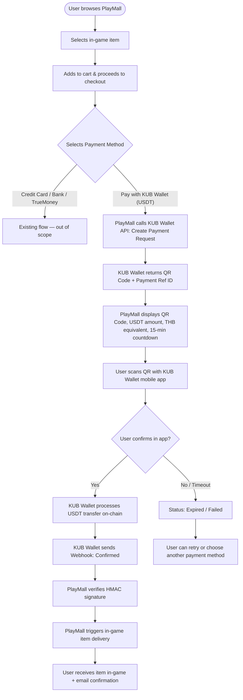
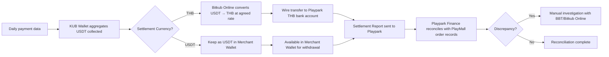
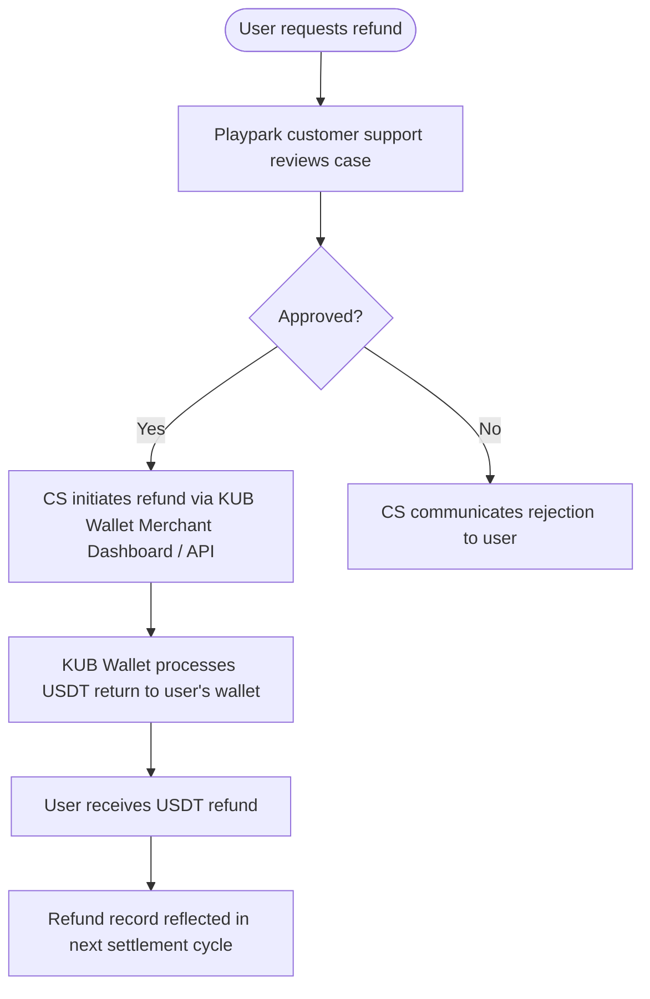

# Business Requirements Document (BRD)

**Project:** Playpark × KUB Wallet — PlayMall USDT Payment Integration
**Concept:** Concept 2B — Quick Win via KUB Wallet Merchant Integration
**Document ID:** BBT-BRD-PWMP-001
**Version:** 0.1.0 (Draft)
**Date:** 20 May 2026
**Classification:** CONFIDENTIAL — DO NOT DISTRIBUTE
**Prepared by:** Bitkub Blockchain Technology Co., Ltd.

---

## Document Approval

| Role | Name | Signature | Date |
|---|---|---|---|
| Prepared by (Product Manager, BBT) | _TBD_ | | |
| Reviewed by (Tech Lead, BBT) | _TBD_ | | |
| Reviewed by (Compliance, BBT) | _TBD_ | | |
| Reviewed by (Partner Lead, Playpark) | _TBD_ | | |
| Approved by (Executive Sponsor) | _TBD_ | | |

---

## Revision History

| Version | Date | Author | Description |
|---|---|---|---|
| 0.1.0 | 20 May 2026 | BBT Product Team | Initial draft for stakeholder review (Concept 2B) |

---

## Table of Contents

1. Executive Summary
2. Background
3. Project Objectives
4. Project Scope
5. Key Stakeholders
6. Project Constraints
7. Business Requirements
8. Business Process
9. Change Impact

---

# Project Overview

## 1. Executive Summary

โปรเจคนี้คือทางเลือก **Quick Win** สำหรับการเปิดรับการชำระเงินด้วย **USDT (KAP-20 บน KUB Chain)** ในระบบ **PlayMall** (webshop เดิมของ Playpark) โดยไม่ต้องสร้าง platform ใหม่ทั้งหมด แนวทางคือ **Playpark สมัครเป็น Merchant กับ KUB Wallet** แล้วเชื่อมต่อระบบ PlayMall ที่มีอยู่แล้วเข้ากับ **API/SDK/Tools** ที่ KUB Wallet เปิดให้ผู้ค้าใช้งาน เพื่อเพิ่มช่องทาง payment "Pay with KUB Wallet (USDT)" เคียงข้างกับช่องทางเดิม (Credit Card, Bank Transfer, TrueMoney, ฯลฯ)

ข้อดีของแนวทางนี้:
- **เร็วกว่ามาก** — Time-to-market **1–2 เดือน** เทียบกับ Concept 1 ที่ใช้ 4–6 เดือน
- **ลงทุนต่ำกว่ามาก** — ประหยัด smart contract development, NFT infrastructure, wallet abstraction, marketplace logic
- **ความเสี่ยงต่ำ** — ใช้ระบบ PlayMall เดิมที่ผู้ใช้คุ้นเคยอยู่แล้ว, KUB Wallet เป็น licensed custodial wallet ที่อยู่ภายใต้กำกับของ ก.ล.ต. และ ธปท. แล้ว
- **Compliance friendly** — Playpark ไม่ต้องเป็นผู้ถือ private key, ไม่ต้องขอใบอนุญาตสินทรัพย์ดิจิทัล, ใช้ infrastructure ของ Bitkub Group ที่มี license ครบ

ข้อจำกัด:
- **ไม่มี Secondary Market** — ไม่สามารถให้ user-to-user trade in-game item ได้
- **ไม่มี NFT / On-chain ownership** — item ยังเป็น centralized database entry เหมือนเดิม
- **Value capture จำกัด** — ไม่มีรายได้จาก marketplace fee, royalty, listing fee
- **ไม่เป็น Web3 platform เต็มรูปแบบ** — เป็นแค่ "เพิ่ม USDT payment channel"

แนวทางนี้เหมาะกับการ **เริ่มต้น partnership** ระหว่าง Playpark × Bitkub Group โดยเริ่มจาก Low-risk pilot และค่อย expand ไปสู่ Concept 1 (Full Platform) ในเฟสต่อไปได้ ถ้าผลตอบรับดี

---

## 2. Background

### 2.1 ภาพรวมตลาด

- ตลาด Crypto Payment ในไทยเติบโตต่อเนื่อง, มีผู้ถือสินทรัพย์ดิจิทัลกว่า 5 ล้านบัญชี (Bitkub Exchange + อื่นๆ)
- USDT เป็น stablecoin ที่ผู้ใช้คริปโตในไทยถือมากที่สุดและใช้สำหรับการชำระเงินได้สะดวกที่สุด เพราะ peg กับ USD
- **ทธ. 5/2565 (March 2022)** — ก.ล.ต. ห้ามใช้สินทรัพย์ดิจิทัลเป็น "สื่อกลางในการชำระค่าสินค้าและบริการ" (Means of Payment) สำหรับ Digital Asset Business Operators โดยตรง แต่ **ผ่าน Licensed Wallet ที่แปลงเป็นเงินบาทก่อน settlement ให้ Merchant ถือเป็นช่องทางที่ยอมรับได้**
- KUB Wallet (Bitkub NEXT) มีฐานผู้ใช้ 1M+ และมี architecture ที่รองรับ payment-to-merchant อยู่แล้ว (ใช้กับ partners อื่นเช่น TSX by Astronize, Yulgang ฯลฯ มาก่อน)

### 2.2 ภาพรวม Playpark

- Playpark Public Company Limited ภายใต้ Asphere Innovations Group ถือสิทธิ์ publishing เกมออนไลน์รายใหญ่ในไทย (Yulgang Mobile, MapleStory M, Aion Classic, FreeStyle 2, ฯลฯ)
- มี **PlayMall** webshop เปิดให้ผู้เล่นซื้อ in-game item ด้วยบัตรเครดิต, true money, scan QR PromptPay, bank transfer
- มี **PlayID** Single Sign-On account system ที่ใช้กับทุกเกม
- ฐานผู้เล่นที่เป็น early adopter ของ blockchain gaming อยู่แล้ว (Yulgang Origin NFT ที่ออกไปก่อนหน้า)

### 2.3 ภาพรวม KUB Wallet (Bitkub NEXT)

- Non-custodial wallet ที่ดำเนินการโดย Bitkub Online — Licensed Digital Asset Custodian ภายใต้กำกับของ ก.ล.ต.
- รองรับ KUB Chain (EVM-compatible Layer 1), ERC-20/KAP-20 tokens รวมถึง USDT
- มี Merchant Integration program — เปิดให้ร้านค้าสมัครเปิด Merchant Account เพื่อรับชำระด้วย Crypto โดย Wallet จะแปลงเป็น THB หรือคงเป็น USDT ตามตกลง
- มี APIs/SDK รองรับการสร้าง Payment Request, QR Code, Deep Link, Webhook สำหรับ Order Status

### 2.4 Competitive Landscape

**Competitor หลัก:** **NEXT Market** ([nextmarket.games](https://www.nextmarket.games/)) — multi-game webshop platform ที่ใช้ **Unifi Wallet** เป็น wallet infrastructure จุดที่ Concept 2B แตกต่าง:

| มิติ | NEXT Market (Unifi Wallet) | **Concept 2B (Playpark × KUB Wallet)** |
|---|---|---|
| Wallet provider | Unifi Wallet | **KUB Wallet (Bitkub NEXT) — 1M+ users** |
| Exchange backing | Limited | **Bitkub Exchange 5M+ user funnel** |
| License coverage | Wallet-only | **Full Bitkub Group licensed stack** |
| Existing webshop | Built from scratch | **Playpark PlayMall (existing user base)** |
| Co-marketing reach | Wallet user only | **KUB Wallet + Bitkub Exchange + Playpark** |

Differentiator คือ Playpark ไม่ต้องสร้าง webshop ใหม่เพื่อแข่งกับ NEXT Market — แค่เพิ่มช่องทาง USDT บน PlayMall เดิม + ได้ marketing reach จาก Bitkub Group ทั้ง 3 channel

### 2.5 Why Concept 2B (vs Concept 1)

| มิติ | Concept 1 (Full Platform) | **Concept 2B (Quick Win)** |
|---|---|---|
| Time-to-Market | 4–6 เดือน | **1–2 เดือน** |
| Initial Investment | TBD (กำหนดหลัง scope confirmation) | **TBD (lower than Concept 1)** |
| Compliance Risk | กลาง-สูง (ต้องขอ license บางตัว) | **ต่ำ (พึ่ง license ของ Bitkub Group)** |
| Value to Playpark | สูงสุด (primary + secondary + royalty) | **กลาง (USDT payment + brand association)** |
| Disruption to Existing | สูง (เปลี่ยน UX ทั้งหมด) | **ต่ำ (เพิ่มปุ่ม payment เท่านั้น)** |
| Reversibility | ต่ำ (commitment สูง) | **สูง (ถ้าไม่เวิร์คก็ปิด channel ได้)** |

ดังนั้น Concept 2B เหมาะสำหรับการ **เริ่ม partnership อย่างปลอดภัย และพิสูจน์ demand ก่อนลงทุนเต็มสเกล**

---

## 3. Project Objectives

1. **Objective 1 — Payment Channel Expansion:** เพิ่มช่องทางการชำระเงินด้วย USDT ผ่าน KUB Wallet ในระบบ PlayMall ภายใน **1–2 เดือน** นับจากวันเริ่มโครงการ
2. **Objective 2 — Reach New Customer Segment:** เข้าถึงกลุ่มลูกค้าคริปโตที่ถือ USDT (target: KUB Wallet 1M+ user base + Bitkub Exchange users) เพื่อเพิ่มยอดขาย PlayMall อย่างน้อย **10% ภายใน 90 วันหลัง launch**
3. **Objective 3 — Validate Demand for Crypto Payment:** วัด conversion rate และ AOV (Average Order Value) ของ USDT payment เทียบกับ payment เดิม เพื่อใช้ตัดสินใจ Concept 1 ในเฟสถัดไป
4. **Objective 4 — Establish Partnership Foundation:** วาง foundation ของ partnership Playpark × Bitkub Group ผ่าน contract, technical integration, marketing collaboration เพื่อขยายไปสู่ Web3 Platform เต็มรูปแบบในอนาคต
5. **Objective 5 — Maintain Compliance & Risk Posture:** ดำเนินการภายใต้กฎหมายไทยอย่างเคร่งครัด (ทธ. 5/2565, AMLO, PDPA) โดย Playpark ไม่ต้องเป็นผู้ถือสินทรัพย์ดิจิทัลหรือขอใบอนุญาตเพิ่มเติม

---

## 4. Project Scope

### 4.1 In Scope

- **Merchant Onboarding** — Playpark Public Company Limited สมัคร Merchant Account กับ Bitkub Online (KUB Wallet)
- **API Integration** — เชื่อมต่อ PlayMall backend กับ KUB Wallet Payment API เพื่อสร้าง Payment Request, แสดง QR Code, รับ Webhook
- **UI Enhancement** — เพิ่มปุ่ม "Pay with KUB Wallet" ใน checkout page ของ PlayMall ทั้ง web และ mobile responsive
- **QR Code Payment Flow** — User scan QR ใน app KUB Wallet แล้วยืนยันใน mobile app, PlayMall ได้รับ webhook และส่ง item เข้าเกมตามปกติ
- **Settlement Configuration** — Bitkub Online ทำหน้าที่แปลง USDT → THB (หรือคงเป็น USDT ตามที่ตกลง) และโอนเข้าบัญชี Playpark ตามรอบ settlement
- **Order Status Tracking** — แสดงสถานะ Pending / Confirmed / Failed / Expired ใน PlayMall และส่ง email/notification ให้ผู้ใช้
- **Refund Handling** — Process การ refund ผ่านระบบ KUB Wallet (manual หรือ semi-automated)
- **Co-Marketing Campaign** — Launch campaign ร่วมกับ KUB Wallet, Bitkub Exchange, Playpark social channels
- **Compliance Documentation** — เอกสารยืนยันโครงสร้างกฎหมาย, ข้อตกลง Merchant, Privacy Notice ที่ปรับให้ครอบคลุม USDT payment
- **Reporting Dashboard** — Dashboard ภายในสำหรับ Playpark ดู metrics ของ USDT payment (volume, count, conversion, refund rate)

### 4.2 Out of Scope

- **Secondary Marketplace** — ไม่รวมการขาย user-to-user (อยู่ใน Concept 1)
- **NFT / On-chain Item Ownership** — ไม่เปลี่ยน in-game item ให้เป็น NFT (อยู่ใน Concept 1)
- **Custom Wallet / In-House Wallet** — Playpark ไม่สร้าง wallet ของตัวเอง, ใช้ KUB Wallet เป็น 100%
- **Multi-Game Web3 Hub** — Concept 2B ทำเฉพาะ PlayMall เดิมที่มีอยู่แล้ว, ไม่สร้าง landing page ใหม่
- **เพิ่ม Crypto อื่นนอกจาก USDT** — Phase 1 รับเฉพาะ USDT (KAP-20) เท่านั้น, อื่นๆอาจพิจารณาในอนาคต
- **Loyalty Program / Token Reward** — Tokenized loyalty rewards อยู่ใน roadmap อนาคต ไม่อยู่ใน Phase 1
- **Cross-game Inventory Hub / Achievement** — ไม่อยู่ใน scope, ระบบยังคงเป็น per-game database เหมือนเดิม

### 4.3 Phased Rollout

**Phase 0 (Week 1) — Discovery & Contract**
- Merchant onboarding application, KYC/KYB process, contract drafting (สามารถ fast-track ได้เพราะ Playpark = group partner Bitkub อยู่แล้ว)

**Phase 1 (Week 2–6) — MVP Integration**
- Pilot กับ 1–2 เกมแรก (recommendation: Yulgang Mobile หรือ MapleStory M เพราะมีฐาน early adopter)
- API integration + sandbox testing + internal QA
- Soft launch แบบ closed beta ให้ผู้ใช้กลุ่มแรก

**Phase 2 (Week 7–8) — Public Launch + Expansion**
- เปิด USDT payment กับเกมที่เหลือใน PlayMall
- Co-marketing campaign กับ KUB Wallet + Bitkub Exchange
- เริ่มเก็บ data ที่จะใช้ตัดสินใจ Concept 1 phase ถัดไป

**Total: 1–2 เดือน** — aggressive แต่ทำได้ เพราะ leverage ระบบที่มีอยู่แล้วทั้ง 2 ฝั่ง (PlayMall + KUB Wallet Merchant program)

---

## 5. Key Stakeholders

| Name | Job Role | Duties |
|---|---|---|
| Playpark Executive Sponsor (TBD) | Decision Maker | อนุมัติ contract, budget, timeline ฝั่ง Playpark |
| Playpark Tech Lead | Engineering Lead | ดูแล PlayMall integration ฝั่ง Playpark, code review, deployment |
| Playpark Product Manager | Feature Owner | กำหนด UX, feature priority, acceptance criteria |
| Playpark Finance & Legal | Compliance Owner | ทบทวน contract, settlement terms, tax implication |
| Playpark Marketing Lead | Campaign Owner | วาง co-marketing campaign กับ Bitkub Group |
| BBT Product Manager | Product Lead (BBT) | คุม spec, requirement, BRD, sign-off |
| Bitkub Online (KUB Wallet) Merchant Team | Onboarding Support | Process Merchant application, technical handover |
| KUB Wallet API Engineering | Technical Support | Provide API, SDK, sandbox, troubleshoot |
| BBT Compliance | Regulatory Liaison | ดูแลให้ระบบสอดคล้องกับ ทธ. 5/2565, AMLO, PDPA |
| Asphere Innovations (Playpark Parent) | Group-Level Sponsor | Buy-in ระดับ group สำหรับการ scale ไปสู่ Concept 1 |

---

## 6. Project Constraints

| Constraint | Description |
|---|---|
| Regulatory | ต้องดำเนินการภายใต้กรอบ ทธ. 5/2565 — Playpark ห้ามถือ USDT โดยตรง, ต้องให้ KUB Wallet แปลงเป็น THB ก่อน settlement (หรือคงเป็น USDT ในกรณีที่ Playpark ขอจัดตั้ง offshore entity ที่ถูกต้อง) |
| Technical | ต้องไม่กระทบ uptime / performance ของ PlayMall เดิม, integration ต้องเป็น loosely-coupled เพื่อให้สามารถปิดการใช้งานได้ทันทีหากเกิดปัญหา |
| Time | Target launch ไม่เกิน **1–2 เดือน** นับจากวันเริ่มโครงการ (fast-track เพราะ leverage existing PlayMall + KUB Wallet Merchant program) |
| Budget | TBD — รายละเอียดงบประมาณจะกำหนดหลัง scope confirmation กับ Playpark (โดยรวมจะต่ำกว่า Concept 1 มาก เนื่องจาก scope แคบกว่า) |
| Operational | ต้องมี Playpark personnel ในการดูแล customer support สำหรับ USDT payment, รวมถึง refund process ที่อาจซับซ้อนกว่า fiat |
| Branding | UX ของ PlayMall ต้องคงรูปแบบเดิม, KUB Wallet logo และข้อความ "Powered by KUB Wallet" แสดงเฉพาะใน payment step ไม่ครอบคลุมทั้งเว็บ |
| Settlement | Settlement cycle: Daily (T+1) สำหรับ THB / Real-time สำหรับ USDT (negotiable) |
| Refund Policy | กรณี refund: คืนเป็น USDT จำนวนเดิม (FX rate ที่ moment of purchase) — ผู้ใช้ต้องยอมรับความเสี่ยง FX volatility |

---

## 7. Business Requirements

### 7.1 Merchant Onboarding & Setup

| ID | Requirement Description |
|---|---|
| BR-001 | Playpark must register as Merchant with Bitkub Online (KUB Wallet) by completing the standard Merchant onboarding application (KYC/KYB documents, corporate registration, financial statements). |
| BR-002 | The Merchant Agreement must clearly specify the settlement currency (THB or USDT), settlement cycle, fee structure, and refund policy. |
| BR-003 | A dedicated Merchant Account must be provisioned on KUB Wallet with API credentials (Merchant ID, Public Key, Webhook Secret) for use in PlayMall integration. |
| BR-004 | Sandbox / staging environment access must be provided by KUB Wallet to allow Playpark to test the full payment flow before production go-live. |

### 7.2 Payment Channel Integration

| ID | Requirement Description |
|---|---|
| BR-005 | PlayMall must display a "Pay with KUB Wallet (USDT)" option in the checkout payment method selection page, alongside existing payment methods (Credit Card, Bank Transfer, TrueMoney, etc.). |
| BR-006 | When the user selects "Pay with KUB Wallet", the system must call the KUB Wallet Payment API to create a Payment Request and receive a QR Code + Payment Reference ID. |
| BR-007 | The system must display the QR Code on screen along with payment amount in both USDT and equivalent THB (real-time FX rate), and a countdown timer (default 15 minutes). |
| BR-008 | The user must be able to scan the QR with the KUB Wallet mobile app to confirm the payment from their KUB Wallet balance. |
| BR-009 | PlayMall must subscribe to KUB Wallet Webhook to receive payment status updates (Pending, Confirmed, Failed, Expired) in real time. |
| BR-010 | Upon receiving "Confirmed" webhook, PlayMall must trigger the existing in-game item delivery flow (same as other payment methods). |
| BR-011 | The system must handle the "Expired" and "Failed" states by displaying an appropriate error message and allowing the user to retry or choose another payment method. |
| BR-012 | All API requests between PlayMall and KUB Wallet must be signed with HMAC-SHA256 using the Webhook Secret, and webhooks must be verified before processing. |

### 7.3 User Experience

| ID | Requirement Description |
|---|---|
| BR-013 | The PlayMall UX should remain unchanged except for the added KUB Wallet payment option, ensuring minimal disruption to existing users. |
| BR-014 | The KUB Wallet payment page must clearly show: Order ID, Item Description, Amount in USDT, Equivalent in THB, QR Code, Countdown, Merchant Name (Playpark Public Company Limited), and "Powered by KUB Wallet" footer. |
| BR-015 | The system should provide clear copy explaining that the user needs the KUB Wallet mobile app and a USDT balance to complete the payment, with a link to download the app if needed. |
| BR-016 | Upon successful payment, the user should be redirected to the order confirmation page (same as other payment methods) and receive an email/notification with the transaction details including the on-chain transaction hash for transparency. |

### 7.4 Settlement & Reconciliation

| ID | Requirement Description |
|---|---|
| BR-017 | Bitkub Online must settle the collected payments to Playpark's designated bank account (THB) or KUB Wallet Merchant Account (USDT) according to the agreed settlement cycle (default T+1 for THB). |
| BR-018 | Playpark must receive a daily settlement report with: Total Transactions, Total USDT Volume, Total THB Settled, Fees Deducted, Refunds, Net Amount. |
| BR-019 | The reconciliation between PlayMall order records and KUB Wallet settlement reports must be automated to flag discrepancies for manual investigation. |

### 7.5 Refund & Customer Support

| ID | Requirement Description |
|---|---|
| BR-020 | Playpark must establish a refund process that allows customer support to initiate refunds via KUB Wallet's refund API or Merchant Dashboard. |
| BR-021 | The refund must return the original USDT amount (not THB-equivalent) to the user's KUB Wallet, with a disclaimer about FX risk acknowledged at point of purchase. |
| BR-022 | Customer support staff must be trained on the KUB Wallet payment flow, common issues (expired QR, insufficient balance, wrong network), and refund procedures. |

### 7.6 Compliance & Risk

| ID | Requirement Description |
|---|---|
| BR-023 | The integration must operate under the legal framework that allows USDT payment via Licensed Custodial Wallet (KUB Wallet/Bitkub Online), with settlement to Playpark in THB to comply with ทธ. 5/2565. |
| BR-024 | Playpark must update its Privacy Notice and Terms of Service to disclose the KUB Wallet payment integration, including data sharing scope with Bitkub Online (limited to: order amount, order ID, settlement details — NOT personal info beyond what's needed). |
| BR-025 | The system must comply with AMLO requirements via KUB Wallet's existing KYC infrastructure — Playpark relies on Bitkub Online's KYC; no additional KYC is required from Playpark for this payment method. |
| BR-026 | All payment data must be encrypted in transit (TLS 1.2+) and at rest (AES-256), and access logs must be retained for at least 5 years per PDPA / financial regulations. |

### 7.7 Reporting & Analytics

| ID | Requirement Description |
|---|---|
| BR-027 | Playpark must have access to a Merchant Dashboard (provided by KUB Wallet) showing real-time transaction data, settlement history, and refund records. |
| BR-028 | Internal Playpark BI dashboard should be updated to include USDT payment metrics: volume, count, conversion rate, AOV, refund rate, broken down by game and time period. |
| BR-029 | A monthly performance review must be conducted between Playpark and Bitkub Group to assess KPIs and decide on next-phase expansion (potentially Concept 1). |

### 7.8 Co-Marketing & Launch

| ID | Requirement Description |
|---|---|
| BR-030 | A co-marketing plan should be developed with KUB Wallet and Bitkub Exchange to drive awareness of the new USDT payment channel, leveraging both Playpark and Bitkub Group's user base. |
| BR-031 | Launch campaign should include: announcement post, special promotion (e.g., discount or bonus item for first 1,000 USDT purchases), social media collaboration, and influencer partnership with selected gaming streamers. |
| BR-032 | Performance targets for the launch: 10,000+ USDT transactions in the first 90 days, 5%+ of total PlayMall sales coming from USDT within 6 months. |

---

## 8. Business Process

### 8.1 USDT Payment Flow (End-to-End)

**Figure 1:** USDT Payment Flow — Concept 2B (Merchant Integration)

### 8.2 Settlement & Reconciliation Flow

**Figure 2:** Settlement & Reconciliation Flow

### 8.3 Refund Flow

**Figure 3:** Refund Flow

---

## 9. Change Impact

### 9.1 Impact on People / Roles

| Role | Current State | Future State | Impact Level | Mitigation |
|---|---|---|---|---|
| Playpark Engineering | Maintains PlayMall webshop with existing payment integrations | Add KUB Wallet payment integration; maintain webhook handler | **Low** | Provide SDK and clear API docs; allocate 1–2 engineers for 8–12 weeks |
| Playpark Customer Support | Handles fiat refunds and payment issues | Additionally handles USDT payment inquiries, refunds, FX questions | **Medium** | Training program with KUB Wallet; create dedicated FAQ; runbook for common issues |
| Playpark Finance | Reconciles fiat payment settlements | Additionally reconciles USDT/THB settlement reports from KUB Wallet | **Low** | Automated reconciliation tool; monthly review with Bitkub Online |
| Playpark Marketing | Markets PlayMall to existing user base | Co-markets with Bitkub Group to crypto user base | **Medium** | Joint marketing playbook; shared analytics dashboard |
| Playpark Legal / Compliance | Reviews fiat payment contracts | Reviews Merchant Agreement with Bitkub Online; updates Privacy Notice | **Low** | One-time legal review; pre-drafted Privacy Notice provided by BBT |
| BBT Product / Engineering | N/A (new partnership) | Provides integration support, technical liaison, change management | **High** | Dedicated PM + Eng lead from BBT for the duration of the project |

### 9.2 Impact on Processes / Workflows

| Process | Current State | Future State | Impact Level | Mitigation |
|---|---|---|---|---|
| Checkout Flow | User selects from 3–5 fiat payment methods | User additionally sees "Pay with KUB Wallet" option | **Low** | UX A/B test before rollout; clear copy explaining the new option |
| Order Fulfillment | Item delivery triggered on payment confirmation from fiat gateway | Same flow, additionally triggered by KUB Wallet webhook | **Low** | Webhook handler isolated; existing fulfillment logic untouched |
| Refund Process | Refund via existing fiat payment gateway | Additionally refund via KUB Wallet Merchant Dashboard / API | **Medium** | New runbook for CS; refund SLA aligned with KUB Wallet processing time |
| Daily Reconciliation | Single source (fiat gateway report) | Multiple sources including KUB Wallet settlement report | **Medium** | Automated reconciliation engine; monthly manual audit |
| Customer Inquiry Triage | Routed by payment method to relevant CS lane | Added new "crypto payment" lane with trained staff | **Medium** | CS training + escalation path to BBT/Bitkub Online L2 support |
| Marketing Campaign Planning | Solo Playpark planning | Joint planning with Bitkub Group | **Low–Medium** | Quarterly joint planning cadence; shared KPIs |

---

## Appendix A — Timeline

### Timeline (1–2 months total)

| Phase | Duration | Key Activities |
|---|---|---|
| Phase 0: Discovery & Contract | Week 1 | Merchant application, KYC/KYB, contract signing, technical kickoff (fast-track เพราะ group partner อยู่แล้ว) |
| Phase 1: MVP Integration | Week 2–6 | API integration, sandbox testing, internal QA, closed beta launch with 1 game |
| Phase 2: Public Launch | Week 7–8 | Public launch all PlayMall games, co-marketing campaign, performance review |

### Budget

> **Budget detail: TBD** — รายละเอียดงบประมาณจะกำหนดหลัง scope confirmation กับ Playpark
>
> ขอบเขตที่ต้องครอบคลุม: Engineering (Playpark side + BBT/KUB Wallet support), Compliance/Legal, QA, Co-Marketing, Operations/Customer Support, Contingency
>
> หลักการ: งบประมาณรวมของ Concept 2B จะต่ำกว่า Concept 1 อย่างมีนัยสำคัญ เนื่องจาก scope แคบกว่า + leverage ระบบที่มีอยู่แล้ว

---

## Appendix B — Comparison vs Concept 1

| Criteria | **Concept 2B (Quick Win)** | Concept 1 (Full Platform) |
|---|---|---|
| Timeline | **1–2 months** | 4–6 months |
| Budget | TBD (lower than Concept 1) | TBD (กำหนดหลัง scope confirmation) |
| Time-to-Revenue | Week 6 (closed beta) | Month 4 (MVP launch) |
| Compliance Complexity | Low (rely on Bitkub Group license) | Medium–High (multiple licenses) |
| Value Capture | Payment processing volume | Primary + secondary market + royalty |
| User Experience | Familiar (PlayMall + payment add-on) | Brand new Web3 GameFi platform |
| Reversibility | High (turn off channel) | Low (committed investment) |
| Risk | Low | Medium |
| Strategic Position | **Phase 0 — Foundation for Concept 1** | **Phase 1 — Long-term moat** |

**Recommendation:** Concept 2B และ Concept 1 ไม่ใช่ทางเลือก either/or แต่เป็น **2 เฟสของ strategy เดียวกัน**:
- **Phase 0 (Concept 2B, 1–2 เดือน)** — Quick win, validate demand, ตรวจสอบ regulatory clarity, ทดสอบ co-marketing reach
- **Phase 1 (Concept 1, 4–6 เดือน หลัง Phase 0 ผ่าน)** — Scale to full Web3 platform เมื่อ KPIs ของ Phase 0 ผ่านเกณฑ์

---

## Appendix C — Open Questions for Playpark

1. **Settlement Currency Preference:** Playpark ต้องการให้ Bitkub Online ตั้ง settlement เป็น THB (T+1) หรือ USDT (real-time) เป็น default?
2. **Pilot Game Selection:** Playpark อยากเริ่ม pilot กับเกมไหนก่อน? (Yulgang Mobile / MapleStory M / อื่นๆ)
3. **Existing PlayMall Tech Stack:** Stack ปัจจุบันคืออะไร? (Node.js / Spring Boot / Laravel / etc.) มี API gateway / event bus อยู่แล้วหรือไม่?
4. **Customer Support Capacity:** มี staff สำหรับรองรับ inquiry คริปโตได้กี่ FTE? ต้องเทรนเพิ่มเท่าไหร่?
5. **Refund Policy Acceptance:** Playpark ยอมรับ refund เป็น USDT (จำนวนเดิม) ตามที่ระบุใน BR-021 หรือไม่?
6. **Marketing Budget:** งบ co-marketing campaign ที่ Playpark ลงทุนได้คือเท่าไหร่? ต้องการ co-funding กับ Bitkub Group ในสัดส่วนใด?
7. **KPI / Success Criteria:** ตัวชี้วัดความสำเร็จที่ Playpark ใช้ตัดสินใจเดินหน้า Concept 1 คืออะไร? Volume? Conversion? Customer Acquisition Cost?
8. **Exclusivity:** Playpark ต้องการ exclusivity กับ KUB Wallet หรือเปิดให้ wallet อื่น (เช่น Bitazza Wallet) ในอนาคต?

---

**END OF DOCUMENT — BBT-BRD-PWMP-001 v0.1.0**

**CONFIDENTIAL — DO NOT DISTRIBUTE**
