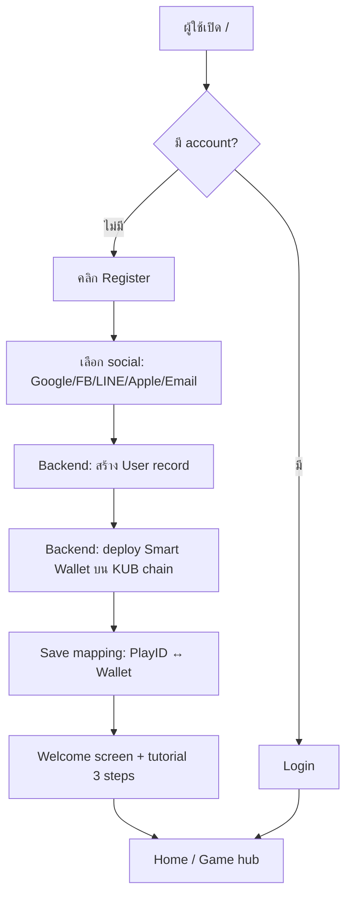
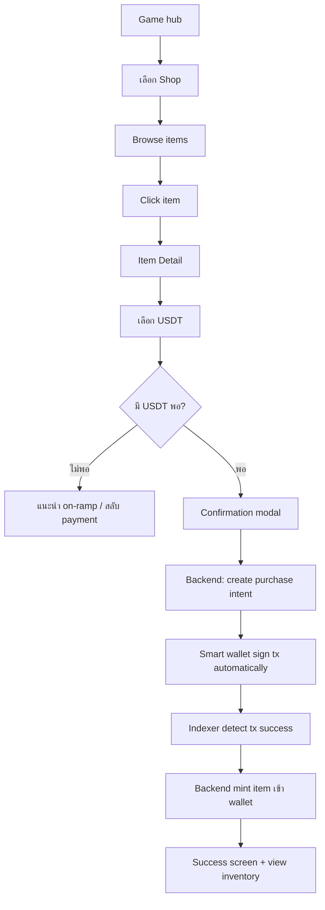
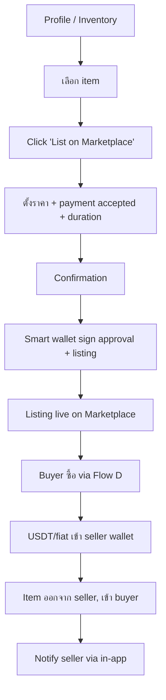
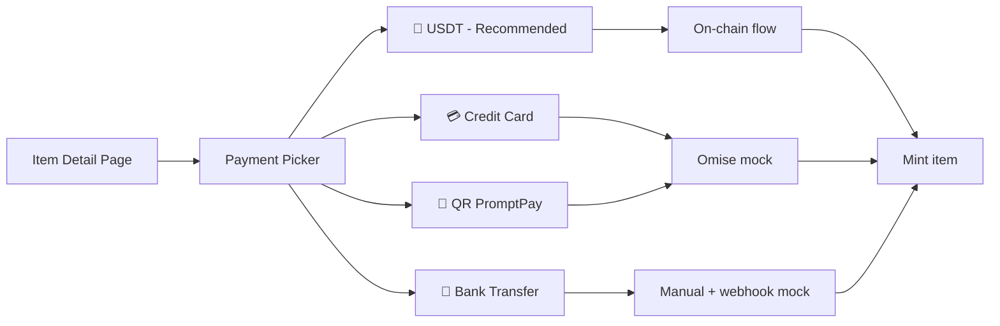

# 📋 PRD — Webshop GameFi MVP Prototype

| Field | Value |
|---|---|
| **Document type** | Prototype Requirement Document (PRD) — light spec |
| **Version** | v0.1 (Draft for Review) |
| **Owner** | Project Manager (PM Agent) |
| **Stakeholder** | Bitkub Blockchain Technology (BBT) × Playpark |
| **Date** | 2026-05-14 |
| **Status** | 🟡 Draft — รอ stakeholder approve ก่อน delegate ต่อ |

> ⚠️ **เอกสารนี้เป็น Prototype scope** — ไม่ใช่ production SRS/BRD เต็มรูปแบบ  
> เน้น user flow + key screen + scope alignment เพื่อใช้ build prototype  
> ส่วน technical/compliance detail จะทำเอกสารแยกใน phase ถัดไป

---

## 1. 🎯 Vision & Objective

### 1.1 Vision
สร้าง **Web3 GameFi platform** ที่เชื่อมโลก gamer ไทยเข้ากับ blockchain โดยให้ผู้เล่นซื้อ in-game items และ trade ระหว่างกันได้ — โดย **"hide the blockchain"** ให้ casual gamer ใช้ได้เหมือน webshop ทั่วไป แต่เปิดพลัง Web3 (true ownership, USDT payment, P2P trading) ให้ผู้ที่พร้อม

### 1.2 Strategic Goal
- 🥇 **First-mover ในไทย** — Playpark เป็นรายแรกที่รับ USDT ผ่าน KUB Chain
- 🤝 **B2B2C platform** — เป็น infra ให้ publisher อื่นๆ ขึ้นมา onboard ในอนาคต
- 💰 **New revenue stream** — secondary market fee จาก P2P trading

### 1.3 Prototype Scope Goal
- ✅ ใช้ demo/validate concept กับ internal stakeholder, partner (Playpark), regulator (ก.ล.ต./ธปท. หากต้องการ)
- ✅ Validate UX hypothesis: "casual gamer ใช้ USDT/wallet ได้โดยไม่กลัว"
- ✅ Foundation สำหรับ production-grade phase ถัดไป

---

## 2. 👥 Target User (Progressive Disclosure)

### Persona A — Casual Thai Gamer ("น้องบาส")
- อายุ 16-30, เล่น MapleStory/Yulgang มาหลายปี
- ไม่เคยใช้ crypto wallet, ไม่รู้จัก KUB / USDT
- ใช้ TrueMoney / PromptPay ปกติ
- ภาษา: ไทย
- Device: 75%+ mobile
- **UX need:** Hide blockchain — เห็นแค่ "ของในเกม + ราคา + ปุ่มซื้อ"

### Persona B — Crypto-Savvy Gamer ("พี่เอิร์ธ")
- อายุ 22-40, ถือ USDT อยู่ใน Bitkub/exchange
- เคยใช้ MetaMask, OpenSea
- มอง gaming asset = investment
- ภาษา: ไทย/อังกฤษ
- Device: desktop + mobile
- **UX need:** Advanced mode — เห็น wallet address, export private key (ในอนาคต), link to explorer

### Design Strategy
**Default = Persona A experience**, ปุ่ม "Advanced" / "Wallet info" ซ่อนใน profile/settings สำหรับ Persona B

---

## 3. 🎮 MVP Scope

### 3.1 Pilot Games (Launch)
| Game | Publisher | Item Categories | Volume Est. |
|---|---|---|---|
| **MapleStory** | Playpark | Cosmetics, Pet, Equipment | High (active EN/TH community) |
| **Yulgang** | Playpark | Costume, Mount, Buff item | Mid (loyal player base) |

### 3.2 Pages In Scope (Full Sitemap)

```
✅ /                                    Landing — เกมทั้งหมด
✅ /auth/login                          PlayID login
✅ /auth/register                       PlayID register + wallet creation
✅ /games/maplestory                    Game hub (MapleStory)
✅ /games/yulgang                       Game hub (Yulgang)
✅ /games/{gameId}/shop                 Webshop (Primary Market)
✅ /games/{gameId}/shop/item/{itemId}   Item Detail + Payment
✅ /games/{gameId}/marketplace          Marketplace (Secondary, P2P)
✅ /games/{gameId}/marketplace/{tokenId} Marketplace Item Detail
✅ /profile                             PlayID Profile + Wallet
✅ /profile/inventory                   ของในกระเป๋า (อยู่ใน game แต่ละเกม)
✅ /profile/transactions                ประวัติธุรกรรม
```

### 3.3 Out of Scope (สำคัญ — กันงานบาน)

- ❌ Publisher admin dashboard
- ❌ Real smart contract บน mainnet (prototype = testnet หรือ mock)
- ❌ Real fiat payment integration (Omise/2C2P/PromptPay จริง) — ใช้ mock UI
- ❌ KYC integration (กล่อง KYC จะ stub ไว้)
- ❌ Bridge USDT cross-chain (ใช้ KUB chain USDT เท่านั้น)
- ❌ Notification (email, push)
- ❌ Customer support / dispute resolution flow
- ❌ Multi-language จริง (มี text key พร้อม TH ก่อน, EN เป็น placeholder)
- ❌ Analytics dashboard

---

## 4. 🔐 Key Technical Decisions

### 4.1 Wallet Architecture
- **Model:** Smart Wallet / Account Abstraction (ERC-4337)
- **Provider candidate:** Privy / Web3Auth / custom AA factory (Crypto Researcher จะวิเคราะห์ใน phase ถัดไป)
- **UX:** Social login (Google/Facebook/LINE/Apple) → backend สั่ง deploy smart wallet บน KUB chain → user ไม่เห็น seed phrase
- **Gas:** Platform-sponsored (paymaster pattern) — gamer ไม่ต้องถือ KUB

### 4.2 Blockchain
- **Chain:** KUB Chain (Bitkub Chain, EVM-compatible)
- **Token standards:**
  - In-game items: ERC-1155 (multi-edition)
  - Premium/unique items: ERC-721
  - Royalty: EIP-2981
- **Currency:** USDT บน KUB chain (KAP20 standard — Crypto Researcher ต้อง verify)

### 4.3 Payment Methods (ทั้ง 4 พร้อมกัน)
| Method | Status ใน Prototype | Production Provider Candidate |
|---|---|---|
| 💎 **USDT (on-chain)** | Real testnet integration | KUB chain native |
| 💳 **Credit Card** | Mock UI + flow | Omise / 2C2P / Stripe |
| 📱 **QR PromptPay** | Mock UI + flow | Omise / SCB / KBank |
| 🏦 **Bank Transfer** | Mock UI + flow | Manual confirm + webhook |

> ⚠️ **USDT = hero feature** — UI ต้อง highlight, มี incentive (discount/badge) เพื่อ encourage adoption

---

## 5. 🎨 Brand & UX Direction

### 5.1 Brand Strategy
- **Per-game branding** — MapleStory pages ใช้ MapleStory color/asset, Yulgang ใช้ Yulgang vibe
- **Common chrome** — Header (PlayID nav), Footer, Payment modal ใช้ shared design system
- **Platform identity** subtle — แสดง "Powered by KUB Chain" ใน footer/payment screen

### 5.2 UX Principles (จาก agents/uxui-designer.md)
1. **Hide the blockchain** — ไม่มี 0x address ใน main flow, ไม่ใช้คำ "gas/mint/sign"
2. **USDT first-class** — payment method picker ขึ้น USDT default
3. **Mobile-first** — ทุก screen design มือถือก่อน
4. **Trust signal** — verified item, seller reputation, escrow status
5. **Progressive disclosure** — advanced mode สำหรับ crypto user ใน profile

---

## 6. 🚦 Functional Requirements (Light)

### FR-1: PlayID Authentication
- FR-1.1: User สามารถ register ด้วย email/Google/Facebook/LINE/Apple
- FR-1.2: ระบบสร้าง smart wallet (ERC-4337) บน KUB chain อัตโนมัติหลัง register
- FR-1.3: User login ครั้งถัดไปด้วย credential เดิม + 2FA optional
- FR-1.4: Recovery — email reset (prototype phase) → social recovery (phase 2)

### FR-2: Landing & Game Hub
- FR-2.1: Landing แสดงเกมทั้งหมดบน platform (card grid)
- FR-2.2: Click game card → ไป game hub ของเกมนั้น
- FR-2.3: Game hub แสดง: hero banner, featured items, link ไป shop/marketplace

### FR-3: Webshop (Primary Market)
- FR-3.1: แสดง list of items ที่ publisher ลงขาย
- FR-3.2: Filter by category, price range, rarity
- FR-3.3: Sort by: newest, price asc/desc, popular
- FR-3.4: Pagination หรือ infinite scroll
- FR-3.5: Item card แสดง: image, name, price (USDT + THB equivalent), rarity

### FR-4: Webshop Item Detail
- FR-4.1: แสดง item image (gallery), name, description, stats
- FR-4.2: แสดง 4 payment method ให้เลือก
- FR-4.3: USDT button = primary CTA, มี badge "Recommended"
- FR-4.4: ปุ่ม "Buy Now" → ไป payment flow
- FR-4.5: แสดง stock available (ถ้า limited edition)

### FR-5: Marketplace (Secondary, P2P)
- FR-5.1: แสดง listing ที่ user คนอื่นเอามาขาย
- FR-5.2: Filter เพิ่ม: payment accepted (USDT only, fiat allowed)
- FR-5.3: Sort + pagination เหมือน webshop
- FR-5.4: Card แสดง: image, name, price, seller (nickname), listing time

### FR-6: Marketplace Item Detail
- FR-6.1: แสดง item full info + on-chain provenance (tx history)
- FR-6.2: แสดง seller profile (nickname, sales count, rating)
- FR-6.3: ปุ่ม "Buy Now" (instant) + "Make Offer" (negotiate)
- FR-6.4: แสดง similar listings ด้านล่าง

### FR-7: Payment Flow
- FR-7.1: Confirmation modal — สรุปสิ่งที่ซื้อ + ราคา + payment method
- FR-7.2: USDT flow — show network (KUB), approve → send → confirm
- FR-7.3: Fiat flow (mock) — redirect to mock payment page → return success
- FR-7.4: Success page — "ของถูกส่งเข้ากระเป๋าแล้ว" + view in inventory CTA

### FR-8: PlayID Profile
- FR-8.1: แสดง avatar, nickname, email
- FR-8.2: แสดง wallet address (shortened `0x12...AB`) + copy button
- FR-8.3: แสดง balance: USDT + (cached) THB equivalent
- FR-8.4: Tab: Inventory (per-game), Transactions, Settings

### FR-9: Inventory
- FR-9.1: แสดงของในกระเป๋า แยกตามเกม
- FR-9.2: Click item → ดู detail + ปุ่ม "List on Marketplace"

### FR-10: Transaction History
- FR-10.1: List ทุก transaction (buy primary, buy/sell secondary, transfer)
- FR-10.2: แต่ละ row: date, type, item, amount, status, link to KUB explorer (advanced mode)

---

## 7. 📐 User Flows (Mermaid)

### Flow A — Onboarding + Wallet Creation



### Flow B — Primary Market Purchase (USDT)



### Flow C — Secondary Market — List & Sell



### Flow D — Payment Method Comparison (Item Detail)



---

## 8. 🛡️ Non-Functional Requirements (Light)

| Category | Requirement | Prototype Target |
|---|---|---|
| **Performance** | Page load (LCP) | < 2.5s |
| **Performance** | Tx confirmation feedback | < 10s |
| **Availability** | Uptime | Best-effort (prototype) |
| **Security** | No private key in DB | Mandatory |
| **Security** | HTTPS only | Mandatory |
| **Accessibility** | Color contrast | WCAG AA |
| **i18n** | Default language | TH (text key พร้อม EN) |
| **Browser** | Support | Chrome/Safari latest, Mobile Safari/Chrome |
| **Responsive** | Breakpoints | Mobile (≤640), Tablet (≤1024), Desktop |

---

## 9. ⚖️ Compliance / Regulatory (Pre-flagging)

> ก่อนไปต่อระดับ production ต้อง consult Crypto Researcher + legal โดยใช้ skill `thai-finlaw-consultant`

| Concern | Risk Level | Note |
|---|---|---|
| Custodial wallet license (ก.ล.ต.) | 🔴 High | Smart wallet ตามนิยามใหม่อาจไม่ถือเป็น custodial — ต้อง verify |
| USDT as means of payment (ธปท.) | 🟠 Med | ธปท. มี circular เรื่อง crypto payment ในไทย — ต้องเช็ค |
| NFT trading on secondary market | 🟠 Med | ขึ้นอยู่กับ classification ของ NFT (utility vs investment) |
| KYC requirement | 🟡 Low (prototype) | จำเป็นในขั้น production สำหรับ on/off-ramp + large tx |
| PDPA | 🟡 Low (prototype) | Mandatory ในขั้น production |
| 15% WHT on crypto gain | 🟡 Low (prototype) | จำเป็นใน secondary market settlement (production) |

---

## 10. 📅 Phasing Suggestion (สำหรับหลัง prototype)

| Phase | Scope | Duration |
|---|---|---|
| **Phase 0 — Prototype** (this) | Full sitemap mock + USDT testnet | 4-6 weeks |
| **Phase 1 — Pilot** | 1 game soft launch, real KYC, real fiat | 8-12 weeks |
| **Phase 2 — Scale** | 2-3 games, marketplace open, B2B onboarding | 8-12 weeks |
| **Phase 3 — Platform** | Open SDK ให้ publisher อื่น | TBD |

---

## 11. ❓ Open Questions (รออาจารย์ตอบ / ผม PM จะ delegate ไป research)

1. **USDT บน KUB chain คือ KAP20 standard ใช่ไหม?** → Crypto Researcher
2. **ERC-4337 มี implementation พร้อมใช้บน KUB chain ไหม หรือต้องเขียนเอง?** → Crypto Researcher
3. **Royalty enforcement บน secondary market — เก็บอัตราเท่าไหร่?** → Stakeholder (BBT + Playpark)
4. **Platform fee structure เป็นเท่าไหร่?** (% ของ primary + % ของ secondary) → Stakeholder
5. **Item metadata schema — ใช้ standard ของใคร?** (game-agnostic vs game-specific) → Crypto Researcher + Dev
6. **มี Figma / brand asset ของ MapleStory TH + Yulgang TH ให้ใช้ไหม?** → Stakeholder
7. **Domain name & branding name ของ platform** (เช่น kubplay.games?) → Stakeholder

---

## 12. 🚀 Next Steps (ถ้า PRD นี้ approved)

ผม (PM) จะ delegate งานต่อแบบนี้:

```
┌──────────────────────────────────────────────────────────────┐
│ Step 1 — Crypto Researcher (parallel)                        │
│   → Research USDT on KUB chain (KAP20)                       │
│   → Research ERC-4337 readiness on KUB                       │
│   → Comparable analysis: Astronize / Maxion / NextMarket     │
│   → Output: docs/research/*.md                               │
├──────────────────────────────────────────────────────────────┤
│ Step 2 — UX/UI Designer (parallel)                           │
│   → User flow refinement (จาก Section 7)                     │
│   → Lo-fi wireframe ทั้ง 11 page                              │
│   → Hi-fi prototype HTML (artifact)                          │
│   → Design system starter                                    │
│   → Output: docs/design/*                                    │
├──────────────────────────────────────────────────────────────┤
│ Step 3 — Senior Full Stack Developer (after Step 1-2)        │
│   → Architecture design (docs/architecture/system.md)        │
│   → Scaffold src/frontend (Next.js), src/backend (NestJS)    │
│   → Smart contract draft (src/contracts)                     │
│   → Mock payment integration                                 │
└──────────────────────────────────────────────────────────────┘
```

---

## 13. ✍️ Sign-off

| Role | Name | Approved? | Date |
|---|---|---|---|
| Stakeholder (User) | — | ⏳ Pending | — |
| Project Manager | PM Agent | ✅ Drafted | 2026-05-14 |
| Crypto Researcher | — | — | — |
| UX/UI Designer | — | — | — |
| Senior Dev | — | — | — |
